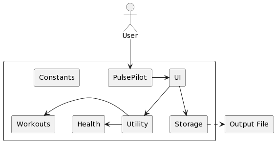
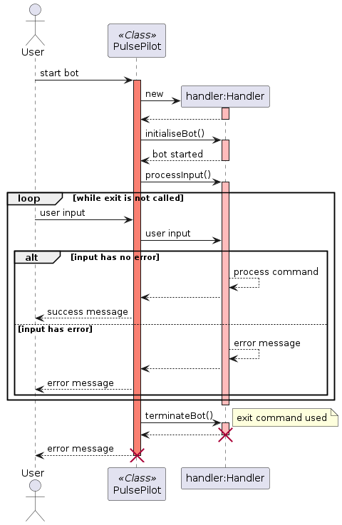
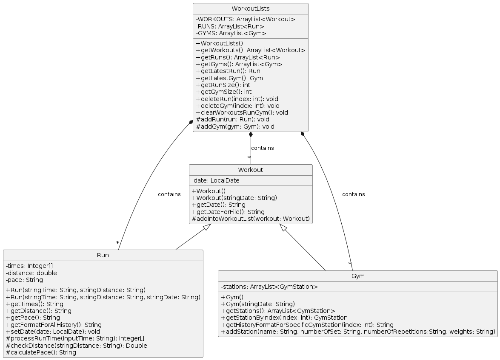
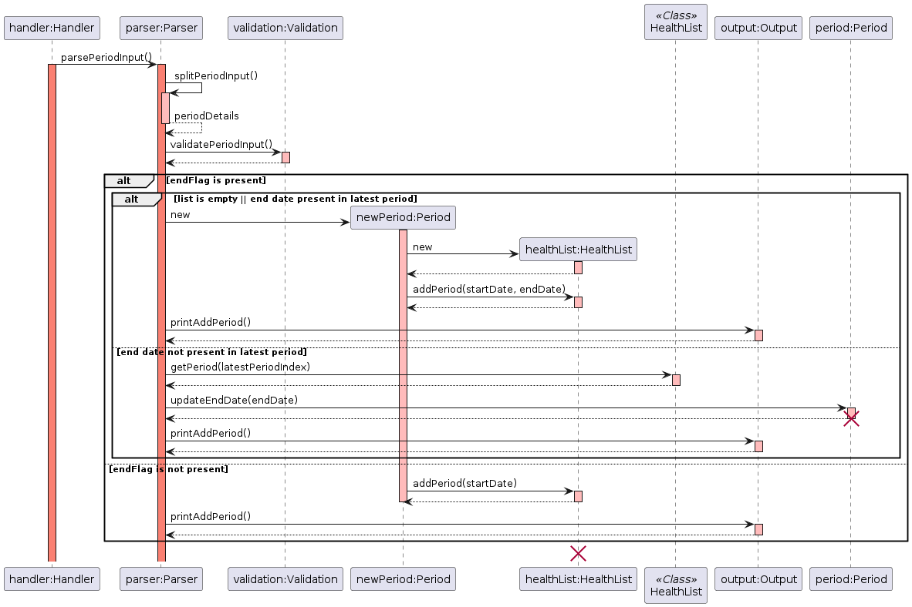

# Developer Guide

## Table of Contents

* [Acknowledgements](#acknowledgements)
* [Introduction](#introduction)
* [Design](#design)
* [Implementation of Commands](#commands-and-implementation)
* [Appendix: DG Requirements](#appendix-requirements)
    * [Product Scope](#target-user-profile)
    * [User Stories](#user-stories)
    * [Non-Functional Requirements](#non-functional-requirements)
    * [Glossary](#glossary)
    * [Manual Testing](#manual-testing)

---

## Acknowledgements

Our team has referenced [Address Book (Level-3)](https://github.com/se-edu/addressbook-level3) and used their [Developer Guide (DG)](https://se-education.org/addressbook-level3/DeveloperGuide.html) to better structure our own Developer Guide.

---

## Introduction

The purpose of this guide is to provide an explanation for all the functions and internal workings in PulsePilot. This enables any technical readers to get a detailed understanding of the application's implementation, making it easier for them to contribute to the project or adapt it according to their preferences.

###### [Back to table of contents](#table-of-contents)

---

## Design

* [Overview of Components](#overview-of-components)
* [UI](#ui-package)
    * [Handler](#handler)
    * [Output](#output)
* [Workout](#workout-package)
    * [WorkoutList](#workout-list)
    * [Gym](#gym)
        * [GymStation](#gym-station)
        * [GymSet](#gym-set)
    * [Run](#run)
* [Health](#health-package)
    * [HealthList](#health-list)
    * [Bmi](#bmi)
    * [Period](#period)
    * [Appointment](#appointment)
* [Utility](#utility-package)
    * [Parser](#parser)
    * [Validation](#validation)
    * [CustomExceptions](#custom-exceptions)
    * [Filters](#filters)
* [Storage](#storage-package)
* [Constants](#constants-package)

---

### Overview of Components

This part of the guide provides a high-level overview of each package and its classes via a class or sequence diagrams. A quick description of each class is given as well. Developers can refer to the code for specific implementation via code documentation.

The application follows an **Object-Oriented Design** approach, with separate classes for handling different components of the application, such as user input, output, exercise logging, and health data management.

The **_Architecture Diagram_** given above explains the high-level design of the PulsePilot.

Given below is a quick overview of main components and how they interact with each other.

`Main` is responsible for the initialising, processing of user input and termination of the bot. It creates a `PulsePilot` instance.

The application can be further broken down into the following packages:

- `Ui`: The user interface of PulsePilot.
- `Storage`: Contains the data storage components for PulsePilot.
- `Health`: Stores health-related information.
- `Workout`: Stores workout-related information.
- `Utility`: Contains utility functions, such as input parsing and validation.
- `PulsePilot`: The main entry point for the application.
- `Constants`: Contains all constants used in PulsePilot.

**The workflow and sequence diagrams of adding objects is covered in the commands section.**

###### [Back to table of contents](#table-of-contents)

---

### UI Package

The `UI` package contains `Handler` and `Output`, which are responsible for handling user input and printing of output fo the screen respectively.

#### Handler

The main entry point of the application is the `Handler` class, used to determine the command used and send the user's input to the correct handler method to process and carry out the action.

The sequence diagram below shows how the application is initialised and processes the user's input using the `Handler` class:

The `Handler` class creates other classes when it is used as shown in this sequence diagram:

The creation of the above classes will be left out of other class diagrams to prevent making complex class diagrams. **It is assumed in other class diagrams for `Handler` that the classes have already been created.**

##### Initialising Bot

 This method is used to check whether the data file is present and not corrupted. How this is done will be covered in `Storage`.

##### Process Input

The `processInput()` method is responsible for determining what command the user has entered, and passes the input to the right handler method.

##### Terminating Bot

The `terminateBot()` method is responsible for **writing to the data file** and exiting the bot gracefully. If a user exits without calling `terminateBot()`, **data will be lost!**

###### [Back to table of contents](#table-of-contents)

---

#### Output

The `Output` class is responsible for printing messages, prompts, errors and other information to the terminal for the user.

The class diagram for `Output` has been omitted as it does not value-add to the guide, since a developer can read the code itself to gain a better understanding of `Output.`

###### [Back to table of contents](#table-of-contents)

---

### Workout Package

The `Workout` package is responsible for tracking run and gym workouts from the user.

#### Workout List

`WorkoutList` is a class that contains the `ArrayList` objects of `Run`, `Gym` and the superclass `Workout`. The class diagram is as follows:

The class contains methods to retrieve the different objects. Additionally, it contains the methods for **deleting** an object from the bot, which is used for the `delete` command implementation.

The `clearWorkoutsRunGym()` method is used to clear all the data stored within each `ArrayList`, which is mainly used for unit testing.

###### [Back to table of contents](#table-of-contents)

---

#### Gym

`Gym` is a class that represents a gym session that the user has recorded. It contains the following variables:

- `date`: An **optional** `LocalDate` parameter representing the date of the workout. Implemented via an overloaded `Gym()` constructor.

**A `Gym` object contains 1 or more `GymStation` objects.**

The class diagram for gym is as follows:

###### [Back to table of contents](#table-of-contents)

---

##### Gym Station

`GymStation` is a class that represents one gym station the user has done in a particular gym session. It contains the following variables:

- `stationName`: Name of the gym station as a `String`.
-  `ArrayList<GymSet>`: An `ArrayList` of `GymSet` object, representing the varying number of sets done at one station.
- `numberOfSets`: The number of sets done as an `int`.

**A `GymStation` object contains 1 or more `GymSet` objects.**

###### [Back to table of contents](#table-of-contents)

---

##### Gym Set

`GymSet` is a class that represents one gym set the user has done in one gym station. It contains the following variables:

- `weight`: The weight done for a gym set represented as a `double`.
- `numberOfRepetitions`: The number of repetitions for a gym set represented as an `int`.

###### [Back to table of contents](#table-of-contents)

---

#### Run

`Run` is a class that represents a run workout the user has recorded. It contains the following variables:

- `times`: A `Integer[]` variable representing the hours, minutes and seconds taken for a run.
- `distance`: The distance run represented as a `double`.
- `date`: An **optional** `LocalDate` parameter representing the date of the workout. Implemented via an overloaded `Gym()` constructor.
- `pace`: The pace of the run in minutes/km represented as a `String`.
- `isHourPresent`: A `boolean` variable to indicate if an hour has been indicated, since the bot accepts both `HH:MM:SS` and `MM:SS` formats.

###### [Back to table of contents](#table-of-contents)

---

### Health Package

The Health component consists of `Health`, `HealthList`, `Bmi`, `Period`, and `Appointment`.

1. `Health` class stores date.
2. `HealthList`class stores separate lists for different `Health` objects using ArrayList. It includes methods to add, delete, view history of the various `Health`lists.
3. `Bmi`class stores bmi attributes (i.e. height, weight, date, bmi value and bmi category).
4. `Period`class stores period attributes (i.e. start date of period, end date of period, period length and cycle length).
5. `Appointment`class stores appointment attributes (i.e. date, time, appointment description). Primarily, `Appointment` has all necessary getter methods to access the attributes.

###### [Back to table of contents](#table-of-contents)

---

#### Health List

The `HealthList` class contains three `ArrayList` variables, to store BMI, Appointment and Period objects, as well as the various methods to retrieve, delete and print the objects stored.

###### [Back to table of contents](#table-of-contents)

---

#### BMI

An object containing information about a user's Body Mass Index (BMI) data. The class automatically calculates the BMI score and determines the corresponding category, then stores that in the object.

This class inherits from the `Health` superclass.

###### [Back to table of contents](#table-of-contents)

---

#### Period

An object containing information about a user's menstrual cycle. The object stores the start and end date as `LocalDate` objects. It also calculates and stores the length of the period flow and period cycle in **days**.

This class inherits from the `Health` superclass.

###### [Back to table of contents](#table-of-contents)

---

#### Appointment

This class inherits from the `Health` superclass.

###### [Back to table of contents](#table-of-contents)

---
### Utility Package

The `Utility` package includes classes and methods that handle exceptions, user input parsing, user input validation, and the various filter strings using enumerations.

It consists of `CustomExceptions`, `Filters`, `Parser` and `Validation` classes.

###### [Back to table of contents](#table-of-contents)

---

#### Parser

The `Parser` class is responsible for the resolving of the user's input. This involves the validating the user input, and then splitting it.

The input **must contain the flags required for each command**, else an exception will be thrown. The number of `/` characters is checked as well, as it can trigger errors. Afterwards, the split input is validated using methods within the `Validated` class. 

The specific usage of `Parser` is covered below in the commands section of this guide.

###### [Back to table of contents](#table-of-contents)

---

#### Validation

The `Validation` class is responsible for validating the user's split input. The split input comes from the `Parser` class in `String[]` variables. Each variable is then checked using regex to ensure that it follows the requirements needed, and that the values are within the stipulated ranges.

The specific usage of `Validation` is covered below for the implementation of each command via sequence diagrams.

###### [Back to table of contents](#table-of-contents)

---

#### Custom Exceptions

The `CustomExceptions` class inherits from the `Exception` class from Java. This class is in charge of printing the various errors from the user's input.

The exceptions are further broken down into the following:

- `OutOfBounds`: When an access with an illegal index is made.
- `InvalidInput`: When user enters input that does not conform with required format or is malformed.
- `FileReadError`: Unable to read the files for `Storage`.
- `FileWriteError`: Unable to write files for `Storage`.
- `FileCreateError`: Unable to create files for `Storage`.
- `InsufficientInput`: When not enough parameters are found for a command.

###### [Back to table of contents](#table-of-contents)

---

#### Filters

The `Filters` class contains all the filter strings for different use cases, such as when adding a workout or viewing the history.

This is represented as enumerations. Attempts to use an invalid filter results in `IllegalArgumentException` being thrown.

###### [Back to table of contents](#table-of-contents)

---

### Storage Package

`Storage` contains `DataFile` and `LogFile`. This component handles all logging of commands used and writing of data stored within PulsePilot to an external data file. The reading of the data file is also done here.

- `DataFile` is responsible for the writing of data to `pulsepilot_data.txt`, and generating the hash for it in `pulsepilot_hash.txt`. It also checks whether the data has been tampered with or files are missing, and creates or deletes files if needed.

- `LogFile` writes the logs to `pulsepilot_log.txt`, tracking each command and error thrown.

###### [Back to table of contents](#table-of-contents)

---

### Constants Package

This package contains all of the different constants used throughout PulsePilot to prevent the usage of magic strings and numbers.

The constants are broken down into the following 4 classes:

- `HealthConstant`: All constant strings and numbers related to all `Health` commands and methods.
- `WorkoutConstant`: All constant strings and numbers related to all `Workout` commands and methods.
- `ErrorConstant`: All strings used when exceptions are thrown.
- `UiConstant`: All other constants and numbers that are not within the above three classes, such as file names, flags, and other general purpose constants.

###### [Back to table of contents](#table-of-contents)

---

## Commands and Implementation

**NOTE**: Not all methods are fully explained here, as any developer can read the source code to find out all the specifics. This helps to keep the guide shorter and easier to read. For example, `extractSubstringFromSpecificIndex()` is mentioned, but its implementation is not covered.

* [Workout](#workout)
    * [Add Run](#add-run)
    * [Add Gym](#add-gym)
* [Health](#health)
    * [Add Period](#add-period)
    * [Add BMI](#add-bmi)
    * [Add Appointment](#add-appointment)
    * [Make Period Prediction](#make-period-prediction)
* [View History](#view-history)
* [View Latest](#view-latest)
* [Delete Item](#delete-item)
* [Storage of Data](#storage-of-data)

### Workout

User input is passed to `Handler.processInput()`, which determines the command used is `workout`. The input is then passed to `Handler.handleWorkout()` as shown in the `Handler` architecture above. It is then split into either 'run' or 'gym' commands.

#### Add Run

The user's input is processed to add a run as follows:

1. `Handler.handleWorkout()` determines the type of exercise which is `run`, and calls the `Parser.parseRunInput()` method to process the user's run input.

2. `Parser.parseRunInput()` splits the input using `Parser.splitRunInput()`. Parameters are extracted using `extractSubstringFromSpecificIndex()` using the different flags.
    - Method also extracts the `date` parameter if present.
    - The method then returns a `String[]` variable with the required parameters extracted from the user input.

3. `Validation.validateRunInput()` is called to validate each parameter. Once valid, correct parameters are used to construct a new `Run` object.

4. The `Run` constructor adds the newly created object into `WorkoutList.WORKOUTS` and `WorkoutList.RUNS`.  Total run time is converted to seconds for calculation of pace.

5. The `Run` object is passed to `Output.printAddRun()` and a message acknowledging the successful adding is printed to the screen.

This is the sequence diagram for adding a run from `parseRunInput()`:

`validateRunInput` uses the `Validation` class to check all the parameters specified by the user when adding a Run, and throws an exception if it is invalid.

###### [Back to table of contents](#table-of-contents)

---

#### Add Gym

The user's input is processed to add a gym is as follows:

1. `Handler.handleWorkout()` determines the type of exercise which is `gym`, and calls the `Parser.parseRunInput()` method to process the user's run input.

2. `Parser.parseGymInput()` splits the input using `Parser.splitGymInput()`. Parameters are extracted using `extractSubstringFromSpecificIndex()` using the different flags.
    - Method also extracts the `date` parameter if present.
    - The method then returns a `String[]` variable with the required parameters extracted from the user input.

3. `Validation.validateGymInput()` is called to validate each parameter. Once valid, correct parameters are used to construct a new `Gym` object.

4. The `Gym` constructor adds the newly created object into `WorkoutList.WORKOUTS` and `WorkoutList.GYMS`.  

5. Afterwards, `parseGymStationInput()` is called to retrieve input for each gym station.

This is the sequence diagram for adding a `Gym` thus far:

The `validateGymInput` method checks for the following validates the parameters from the user, and throws an exception if it is invalid.

##### Add Gym Station

After adding a `Gym` object, the user is then prompted for input for the gym station. It is processed as follows:

1. `Parser.parseGymStationInput()` is called, which starts a loop that iterates `NUMBER_OF_STATION` times.

2. In each loop, `Output.printGymStationPrompt()` is used to print the prompt for the user, and user input is retrieved.

3. User input is passed to `Validation.splitAndValidateGymStationInput()`, which as the name suggests, splits and validates the parameters from the user. Parameters are extracted using `extractSubstringFromSpecificIndex()` using the different flags.

4. After splitting the input, the weights specified is validated via `Validation.validateWeightsArray()`.

5. After all parameters are validated, it is passed to `Gym.addStation()` to add a `GymStation` object to the existing `Gym` object. The `GymStation` object is appended to an `ArrayList<GymStation>` variable.

6. Steps 2 to 4 repeat until all stations have been added.

7. The final `Gym` object is passed to `Output.printAddGym()` and a message acknowledging the successful adding is printed to the screen.

This is the sequence diagram for adding a `GymStation` object:

`splitAndValidateGymStationInput()` extracts parameters and validates them, then returns a `String[]` variable containing the parameters.

The `validateWeightsArray()` method converts the `String[] weightsArray` variable returned from `splitAndValidateGymStationInput()`, validates the numbers, and returns an `ArrayList<Double>`.

###### [Back to table of contents](#table-of-contents)

--- 

### Health

User input is passed to Handler.processInput(), which determines the command used is health. The input is then passed to Handler.handleHealth() as shown in the Handler architecture above. It is then split into either 'bmi', 'period', 'prediction' or 'appointment' commands.

#### Add Period

##### Period Sequence

The user's input is processed to add a run as follows:

1. `Handler.handleHealth()` determines the type of health which is period, and calls the `Parser.parsePeriodInput()` method to process the user's period input.

2. `Parser.parsePeriodInput()` splits the input using `Parser.splitPeriodInput()`. Parameters are extracted using `extractSubstringFromSpecificIndex()` using the different flags.
   - Method also extracts the end date parameter if present. 
   - The method then returns a String[] variable with the required parameters extracted from the user input.

3. `Validation.validatePeriodInput()` is called to validate each parameter. Once valid, correct parameters are used to construct a new `Period` object.

4. If end date is absent, the `Period` constructor adds the newly created object into `HealthList.PERIODS`. Else, the `PERIOD.get(period)` is called to retrieve the latest period input and update end start using `updateEndDate()` method. 
   - If the `HealthList.PERIODS` is not empty, `setCycleLength()` will be called to calculate the cycle length. 

5. The `Period` object is passed to `Output.printAddPeriod()` and a message acknowledging the successful adding is printed to the screen.

This is the sequence diagram for adding a period from `parsePeriodInput()`:

###### [Back to table of contents](#table-of-contents)

---

#### Add BMI

The user's input is processed to add a run as follows:

1. `Handler.handleHealth()` determines the type of health which is period, and calls the `Parser.parseBmiInput()` method to process the user's period input.

2. `Parser.parseBmiInput()` splits the input using `Parser.splitPeriodInput()`. Parameters are extracted using `extractSubstringFromSpecificIndex()` using the different flags.
    - The method returns a String[] variable with the required parameters extracted from the user input.

3. `Validation.validateBmiInput()` is called to validate each parameter. Once valid, correct parameters are used to construct a new `Bmi` object.

4. The `Bmi` constructor adds the newly created object into `HealthList.BMIS`. The BMI value and Bmi category will be obtained from `calculateBmiValue()` method and `getBmiCategory()' respectively. 

5. The `Bmi` object is passed to `Output.printAddBmi()` and a message acknowledging the successful adding is printed to the screen.

This is the sequence diagram for adding a period from `parseBMiInput()`:

###### [Back to table of contents](#table-of-contents)

---

#### Add Appointment

1. User input is passed to `Handler.processInput()`, which determines the command used is `health`, thus passing the input to `Handler.handleHealth()`.

2. `Handler.handleHealth()` determines the type of health which is `appointment`, and calls the `Parser.parseAppointmentInput()` method to process the user's input.

3. `Parser.parseAppointmentInput()` splits the input using `Parser.splitAppointmentDetails()`. It then validates each input using `Validation.validateAppointmentDetails()`.
    - `CustomExceptions.InsufficientInput` is thrown if either not enough parameters are specified or blank parameters are found.
    - `CustomExceptions.InvalidInput` is thrown if the parameters passed in are invalid and do not follow the stipulated format.

4. If valid, a new `Appointment` object is created with the split user input.

5. The `Appointment` constructor adds the newly created object into `HealthList.APPOINTMENTS`.

6. The `Appointment` object is passed to `Output.printAddAppointment()` and a message acknowledging the successful adding is printed to the screen.

###### [Back to table of contents](#table-of-contents)

---

#### Make Period Prediction

###### [Back to table of contents](#table-of-contents)

---

### View History

###### [Back to table of contents](#table-of-contents)

---

### View Latest

###### [Back to table of contents](#table-of-contents)

---

### Delete Item

###### [Back to table of contents](#table-of-contents)

---

### Storage of Data

###### [Back to table of contents](#table-of-contents)

---

## Appendix: Requirements

* [Product Scope](#product-scope)
    * [Target User Profile](#target-user-profile)
    * [Value Proposition](#value-proposition)
* [User Stores](#user-stories)
* [Non-Functional Requirements](#non-functional-requirements)
* [Glossary](#glossary)
* [Manual Testing](#manual-testing)

### Product scope

#### Target user profile

PulsePilot is built for both patients and healthcare professionals.

- Patients can upload data related to their well-being via the health tracker and progress on recovery exercises through the workout tracker.
- Healthcare professionals can use PulsePilot to easily monitor their patient's recovery progress and general well-being outside of the hospital.
- For users that are familiar with the CLI and can type fast.

###### [Back to table of contents](#table-of-contents)

---

#### Value proposition

PulsePilot is a health monitoring application designed to bridge the gap between medical professionals and patients during outpatient recovery.

PulsePilot offers outpatients the capability to input and track a range of health activities, encompassing both aerobic and anaerobic exercises, alongside crucial health parameters such as BMI and menstrual cycles.

Simultaneously, PulsePilot facilitates access to this vital data for various healthcare professionals, ensuring comprehensive and seamless support in guiding outpatient recovery processes.

###### [Back to table of contents](#table-of-contents)

---

### User Stories

| Version | As a ...              | So that I can ...                                     | I want to ...                         |
|---------|-----------------------|-------------------------------------------------------|---------------------------------------|
| 1.0     | gym enthusiast        | track my gym sessions                                 | enter my gym stats                    |
| 1.0     | runner                | see my relative speed for each run                    | see my running pace                   |
| 1.0     | runner                | track my running progress over time                   | log my runs                           |
| 1.0     | health conscious user | track change in my weight over time                   | calculate my BMI                      |
| 1.0     | female user           | monitor any deviations from my normal menstrual cycle | track my menstrual cycle              |
| 2.0     | runner                | quickly view my most recent run details               | see my latest run                     |
| 2.0     | gym enthusiast        | quickly view my most recent gym session               | see my latest gym session             | 
| 2.0     | gym enthusiast        | accurately track my progress and strength gains       | enter varying weights for sets        | 
| 2.0     | female user           | plan ahead and better manage my health                | p#D85D43ict my next period start date | 
| 2.0     | injured user          | remember the appointments I have                      | track my medical appointments         |

###### [Back to table of contents](#table-of-contents)

---

### Non-Functional Requirements

- **Usability**: The application should have a user-friendly command-line interface with clear instructions and prompts for user input.
- **Reliability**: The application should handle invalid or incomplete user input gracefully, providing appropriate error messages and prompting the user for correct input.
- **Maintainability**: The codebase should follow best practices for Object-Oriented Programming, including proper separation of concerns, modularization, and code documentation.
- **Testability**: The application should have comprehensive unit tests to  ensure correct functionality and enable easier maintenance and future enhancements.

###### [Back to table of contents](#table-of-contents)

---

### Glossary

- **Run**: An exercise activity involving running or jogging, typically characterized by distance, duration, and date.
-  **Gym**: An exercise activity involving various strength training exercises or workouts performed at a gym or fitness center.
- **BMI (Body Mass Index)**: A measure of body fat based on height and weight, used to assess overall health and fitness.
- **Menstrual Period**: A recurring physiological event in females, characterized by the start and end dates.
- **Medical Appointment**: An arrangement with a doctor, physiotherapist, or healthcare professional, to meet at a certain time and place.
- **Flags**: The strings used by the bot to differentiate parameters. For example, `/date:` is the date flag, used to specify the date for a given command.

###### [Back to table of contents](#table-of-contents)

---

### Manual Testing

* [Launching and Termination](#launching-and-termination-testing)
* [Run](#run-testing)
* [Gym](#gym-testing)
* [Period](#period-testing)
* [Prediction](#prediction-testing)
* [BMI](#bmi-testing)
* [Appointment](#appointment-testing)
* [Storage](#storage-testing)

###### [Back to table of contents](#table-of-contents)

---

#### Launching and Termination Testing

###### [Back to table of contents](#table-of-contents)

---

#### Run Testing

###### [Back to table of contents](#table-of-contents)

---
#### Gym Testing

###### [Back to table of contents](#table-of-contents)

---

#### Period Testing

###### [Back to table of contents](#table-of-contents)

---

#### Prediction Testing

###### [Back to table of contents](#table-of-contents)

---

#### BMI Testing

###### [Back to table of contents](#table-of-contents)

---

#### Appointment Testing

###### [Back to table of contents](#table-of-contents)

---

#### Storage Testing

###### [Back to table of contents](#table-of-contents)

---
